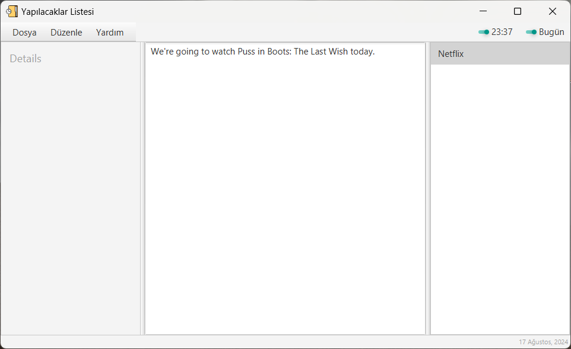
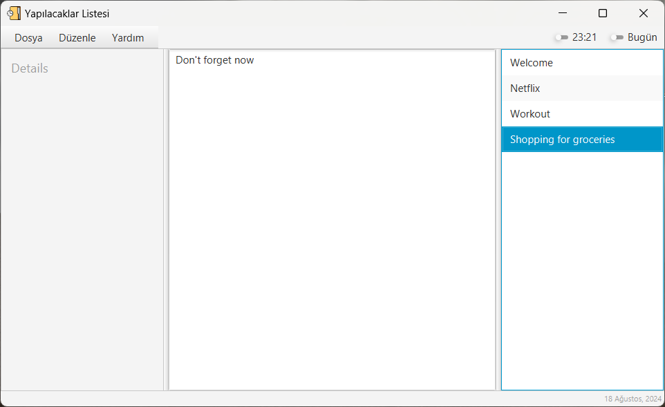
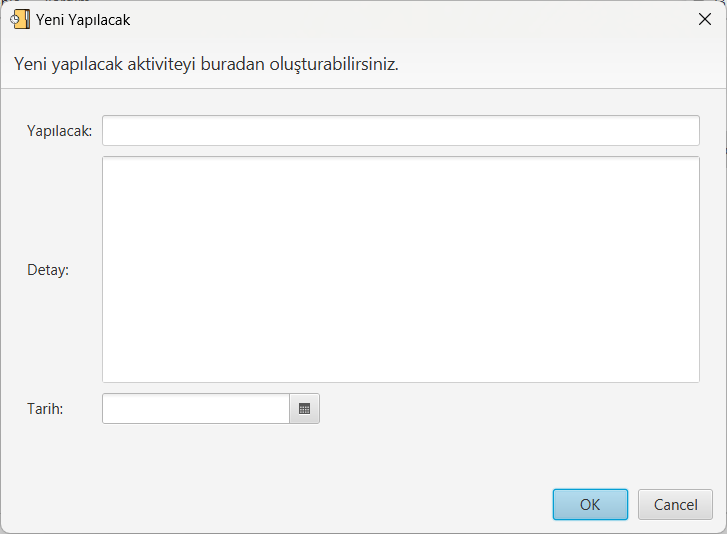

# todo-again

Legacy JavaFX TODO desktop app, revived for modern Java tooling.

## Current status (2026-03-09)
- Build system migrated to Maven.
- Target runtime upgraded to Java 21 + JavaFX 21.
- JFoenix dependency removed, standard JavaFX controls are used.
- Data loading is more defensive for missing or malformed records.
- CI pipeline and baseline tests are in place.

Detailed roadmap: [`docs/revival-plan.md`](docs/revival-plan.md)

## Tech stack
- Java 21 (LTS)
- JavaFX 21 (`controls`, `fxml`, `media`)
- Maven
- JUnit 5
- JaCoCo

## Prerequisites
Choose one setup:

1. Local setup
   - JDK 21 installed and available in `PATH`
   - Maven 3.9+ installed
2. Docker setup
   - Docker Desktop (or Docker Engine + Compose plugin)

Local check:

```bash
java -version
mvn -version
```

## Run locally

```bash
mvn clean javafx:run
```

## Run tests and coverage check

```bash
mvn clean verify
```

This command runs:
- unit tests (JUnit 5)
- JaCoCo report and coverage check

## Run with Docker (no local Java/Maven)
If you do not want to install Java/Maven on your machine, use Docker Compose.

Quick start:

```bash
docker compose run --rm maven clean verify
```

Other useful commands:

```bash
docker compose run --rm maven -v
docker compose run --rm maven clean test
docker compose run --rm maven clean package -DskipTests
```

Detailed guide: [`docs/docker.md`](docs/docker.md)

## Data file
- Default data file: `Yapilacaklar.txt`
- Format: `aciklama<TAB>detay<TAB>dd-MM-yyyy`

The loader now:
- creates the file if missing
- skips malformed lines instead of crashing

## Project structure
- `src/` -> main Java sources + FXML
- `resources/` -> app resources (icons)
- `src/test/java/` -> JUnit tests
- `docs/` -> project documentation

## CI
GitHub Actions workflow: `.github/workflows/ci.yml`

On each push/PR, CI runs `mvn -B verify` on Java 21.

## Screenshots (legacy UI)




## License
MIT (`LICENSE`)
